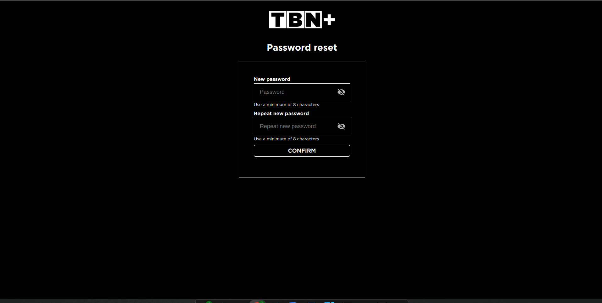

# 📘 Okta IDX Login Integration

## Overview

This section covers user authentication using Okta Identity Engine (IDX) in a React application. It includes:

- **Username/password authentication**
- **Magic Link (email-based) login**
- **Session rehydration with token renewal**
- **Token management and post-authentication navigation**

---

## 🔧 Environment Setup

### Install Required Packages

Run the following command to install the necessary dependencies:

```bash
npm install @okta/okta-auth-js @okta/okta-react
```

### Configure Environment Variables

Set up the following environment variables in your `.env` file:

```env
REACT_APP_OKTA_CLIENT_ID=your-client-id
REACT_APP_OKTA_ISSUER=https://your-okta-domain/oauth2/default
REACT_APP_OKTA_REDIRECT_URI=http://localhost:3000/login/callback
```

---

## 🚀 Authentication Flow

### Session Validation on Component Mount

The application checks for an existing session, retrieves tokens silently, and navigates accordingly.

### Username/Password Authentication

Authenticate users using their email and password.

### Magic Link (Email) Authentication

This flow sends a verification email and polls for user completion.

---

## 🧠 Token Management

Tokens are securely managed using Okta’s `tokenManager`.

---

## 🔒 Security Considerations

- Tokens are securely stored and managed using Okta's `tokenManager`.
- Session validation minimizes unnecessary logins.
- Email authentication polling is rate-limited to prevent abuse.

---

## 🧪 Error Handling

Errors such as network issues, IDX status failures, and validation errors are captured and displayed to users.

---

# 📘 Okta IDX Registration Integration

## Overview

This section covers **user registration** using Okta Identity Engine (IDX) in a React application. It includes:

- User registration via IDX
- Terms and conditions validation
- Token acquisition and storage
- Post-registration navigation

---

## 🚀 Registration Flow

### Registering a New User

User registration is initiated using `oktaAuth.idx.register`. Upon success, tokens are stored, and the user is redirected.

---

## 🧪 Error Handling

Errors are mapped to user-friendly messages. Fallback mechanisms ensure sensitive fields like passwords are cleared for security.

---

# 📘 Okta IDX Password Reset Flow Integration

## Overview

This section outlines the **password recovery flow** using Okta Identity Engine (IDX). It includes:

1. **ResetPassword** – Initiates password recovery
2. **OktaOtp** – Handles OTP verification
3. **NewPassword** – Sets and confirms a new password

---

## 🔁 Flow Summary

1. User enters their email on the Reset Password screen.
2. Okta sends a verification code to their email.
3. User enters the OTP code.
4. User sets a new password.
5. Tokens are issued and stored.

---

## 🔐 Reset Password

Initiate password recovery via email and verify if OTP is required.

---

## 🔢 OTP Verification

Validate the OTP code and proceed. Ensure the OTP is a 6-digit code.

---

## 🔑 New Password Setup

Allow users to set and confirm a new password. Password validation ensures a minimum of 8 characters.

---

## 🧪 Error Handling

Errors are parsed and displayed to users. Special handling is implemented for:

- Invalid tokens
- Password policy violations
- Duplicate accounts

---

## 📚 References

- [Okta Identity Engine SDK Documentation](https://github.com/okta/okta-auth-js)
- [Okta React SDK Documentation](https://github.com/okta/okta-react)
- [Official Okta Documentation](https://developer.okta.com/docs/)

## 🖼️ Flow Screens

### TBN Tenant

#### Login Flow


#### Registration Flow


#### Password Reset Flow
##### Email Form

##### OTP Form

##### New Password Form

---

<!-- ### PBR Tenant

#### Login Flow


#### Registration Flow


#### Password Reset Flow


---

### MSM Tenant

#### Login Flow


#### Registration Flow


#### Password Reset Flow
 -->